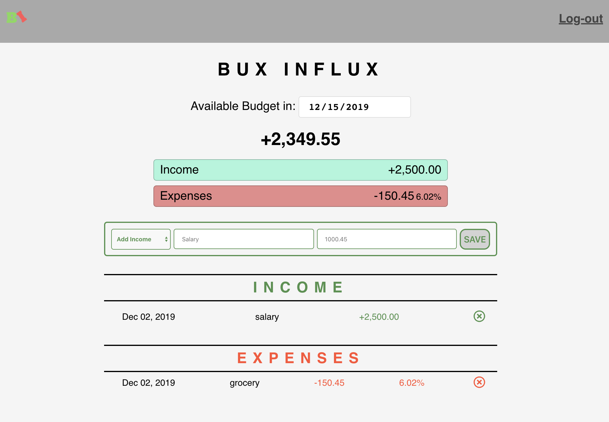
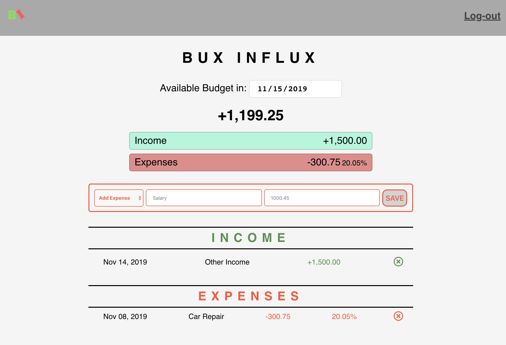

# App name: Bux Influx

Live app: [Bux Influx](https://glaiza-buxinflux-app.now.sh/)

## About Bux Influx

Bux Influx is an application that allows a user to track his or her financial health. By tracking monthly income and expenses, Bux Influx will determine whether or not the user has extra cash left over at the end of the month. Armed with this knowledge, the user can then make informed decisions about how to spend money during future months.

## Technologies used
- Client side: Reactjs, Javascript, HTML and CSS
- Server side: Express.js, Node.js, PostgreSQL

## Services: 

All API call functions live in the src directory in a folder titled services.

## Links:

- Github
    [Client](https://github.com/glaizawagner/bux-influx-client) |
    [Server](https://github.com/glaizawagner/bux-influx-server)

- Heroku
    [Heroku](https://glaiza-buxinflux-server.herokuapp.com/)

## Screenshots

Landing Page – located in routes folder
 

Login Page – located in routes and login form located in components. 
By default, I added username-test and password-password for user to try how my app works.

 
Registration Page – located in routes and Registration form located in components.

Userpage – located in routes and returns three (3) components such as BuxInfluxPage, IncomeList and ExpenseList. 

In BuxInfluxPage is where BudgetFilter(monthly), Balance and AddIncomeExpenses components is returned.

User can add previous Income/Expenses by just changing the month to 11 or which month they want to update.

User will know if they are adding an income or expenses because the color will automatically change to green when they select the type (+) and red when they select the type (-).

The balance will be automatically updated as well as the income and expenses.

Data added for income/expenses will be displayed at the below under Income/Expenses.
 

Userpage – Previous month sample when user changed the current month to 11.

Created by: Glaiza E. Wagner
